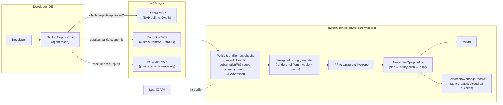
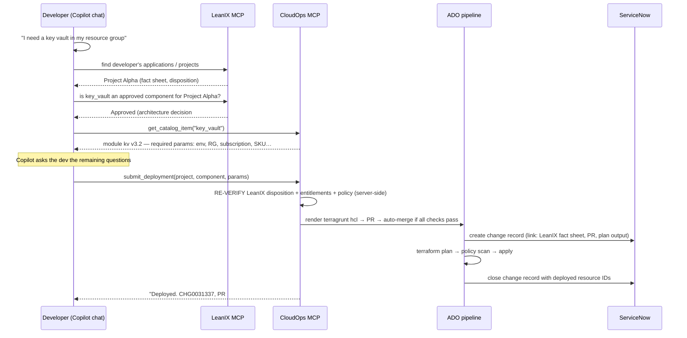

# Governed Self-Service Infrastructure via GitHub Copilot + MCP

**Design document — Cloud/Platform Engineering**
**Status:** Draft for review
**Scope:** Azure infrastructure self-service for application developers, governed by LeanIX architecture approvals, delivered through curated Terraform/Terragrunt modules, audited in ServiceNow.

---

## 1. Problem statement

Today, cloud infrastructure is deployed by the Cloud Engineering team via Terragrunt/Terraform modules and Azure DevOps pipelines. Developers must raise a ticket for every resource request. The ticket exists for two legitimate reasons — **approval** (the architecture review board's disposition, recorded in LeanIX) and **audit** (a ServiceNow record of what was deployed and why). But the mechanism forces Cloud Engineering into the critical path of every deployment, making them a throughput bottleneck for work that is, in most cases, "stamp out an approved pattern."

**Target state:** developers self-serve infrastructure from GitHub Copilot chat. The system — not a human — checks that the request maps to a LeanIX-approved architecture component, selects the correct curated module (which already embeds networking, private endpoints, RBAC, tagging, and policy requirements), collects the remaining parameters conversationally, deploys through the existing pipeline machinery, and automatically files the ServiceNow record. Cloud Engineering's job shifts from *deploying infrastructure* to *curating the module catalog and the guardrails*.

---

## 2. Is this possible? (Yes — every layer exists as a shipped product)

As of 2026, every integration point in this design is generally available:

| Layer | Product | Status |
|---|---|---|
| AI client in the IDE | GitHub Copilot Chat, **agent mode**, with MCP support (VS Code, JetBrains, Copilot CLI) | GA |
| Architecture approval lookup | **SAP LeanIX built-in MCP server** — 40+ tools over applications, fact sheets, architecture decisions, tech stacks; OAuth 2.0 auth; enabled by default for APM customers | GA |
| Module discovery / registry | **HashiCorp Terraform MCP server** — connects agents to the private registry, discovers approved modules, reads inputs/outputs; works with HCP Terraform and Terraform Enterprise | GA |
| Azure operations | **Azure MCP Server 2.0** — 276 tools across 57 services; can be self-hosted as a centrally managed **remote** MCP server with consistent governance | GA |
| Audit record | **ServiceNow MCP server** — create/update change requests, incidents, catalog items; runs through ServiceNow AI Control Tower (identity-verified, permission-scoped, auditable); included in Now Assist SKUs | GA |
| Orchestration glue | Custom "CloudOps" MCP server (our build) + existing Azure DevOps pipelines | Our build |

Nobody ships this exact LeanIX→Copilot→Terraform→ServiceNow chain as a boxed product, because the governance model (LeanIX dispositions driving deploy entitlements) is organization-specific. But the *pattern* — "agentic platform engineering," where Copilot + MCP servers front a curated platform with human-defined guardrails — is documented by Microsoft (All Things Azure: *Agentic Platform Engineering with GitHub Copilot*; *Platform Engineering for the Agentic AI Era*) and HashiCorp (*Terraform MCP server: four real-world AI infrastructure patterns*). The consistent industry finding: **agents propose, platforms enforce, humans approve by exception.**

---

## 3. Design principles

1. **The chat is a front-end, not a control plane.** Copilot (an LLM) must never be the thing that *enforces* policy. All authorization, validation, and deployment decisions execute deterministically server-side in the CloudOps MCP server and the pipeline. If the LLM hallucinates or the developer prompt-injects, the worst outcome is a *rejected request*, never an unauthorized deployment.
2. **Approval is data, not conversation.** The LeanIX disposition is the single source of entitlement: *project X is approved for component types {webapp, aks, sql, key_vault}*. The agent reads it; the CloudOps server independently re-verifies it at execution time. Never trust the client's claim that something is approved.
3. **Modules are the guardrail.** Developers can only deploy through the curated module catalog. Modules embed private endpoints, diagnostic settings, CMK, RBAC baselines, and mandatory tags. Free-form Terraform authored by the agent is never applied.
4. **Everything lands in Git.** Every deployment is a commit + PR in the Terragrunt live repo, applied by the existing Azure DevOps pipeline under its existing service connections. The agent never holds Azure credentials capable of writing infrastructure.
5. **Audit is automatic and unskippable.** The ServiceNow change record is created *by the pipeline/orchestrator*, not by the agent as an optional courtesy step. If the record can't be created, the deploy doesn't proceed.
6. **Guardrails over gates.** A gate needs a human to open it; a guardrail is a condition the system enforces for any actor. Pre-approved patterns flow without human review; only exceptions (unapproved component, prod + high-risk change, policy failure) page a human.

---

## 4. Target architecture

### 4.1 Conversation flow (the developer experience)

The developer never sees Terraform unless they want to. The plan output, PR link, ServiceNow number, and resource IDs come back into the chat.

---

## 5. Component design

### 5.1 LeanIX MCP server (buy — it's built in)

Use SAP LeanIX's native MCP server (OAuth 2.0, per-user access so LeanIX permissions apply). Its role in the flow is **discovery and pre-check only**: help the agent identify the project and read the disposition so it can fail fast and explain *why* something isn't approved.

Prerequisite data-model work (this is the real effort): the "approved components" in LeanIX must be **machine-readable**, not prose in a review-board comment. Recommended: model each approved infra component as a related fact sheet or tagged relation (e.g., `ITComponent: azure_key_vault`, relation attribute `disposition = approved`, plus target subscription/environment). If today the approval lives as a link pasted into a ticket, define a small taxonomy that maps 1:1 to your module catalog: `component_type` values in LeanIX **must equal** catalog keys in the CloudOps server (`key_vault`, `app_service`, `aks`, `sql_db`, …). This contract is the keystone of the whole design.

### 5.2 CloudOps MCP server (build — this is the product)

A remote MCP server (HTTP/SSE, hosted on Azure Container Apps or App Service), authenticated with **Entra ID** (the developer's own identity — never a shared key), exposing a deliberately small tool surface:

| Tool | Purpose |
|---|---|
| `list_catalog()` | Component types offered, mapped to module + version |
| `get_catalog_item(type)` | Required/optional parameters, allowed values (SKUs, regions), naming rules — the agent uses this to know *what questions to ask* |
| `list_my_projects()` | Projects the caller is a team member of (from LeanIX/EntraID group mapping) |
| `check_entitlement(project, type)` | Server-side LeanIX disposition check — returns approved/denied + reason + LeanIX link |
| `validate_request(request)` | Dry-run: entitlement + parameter validation + naming/quota/policy pre-checks; returns errors the agent can relay conversationally |
| `submit_deployment(request)` | The only mutating tool. Re-runs all validation, renders Terragrunt config, opens the PR, triggers the pipeline, returns tracking IDs |
| `get_deployment_status(id)` | Poll plan/apply progress, surface plan summary and errors back into chat |

Key implementation rules:

- **Idempotent and deterministic.** `submit_deployment` takes a fully-specified structured request (JSON), not natural language. The LLM's job ends at producing that JSON.
- **Re-verify everything server-side.** The server calls LeanIX's API itself (service principal, technical user) at submit time. It never trusts that the agent already checked.
- **Scope enforcement.** Map project → allowed subscriptions/resource groups (from LeanIX or a config file in Git). A developer on Project Alpha cannot deploy into Project Beta's RG regardless of what they type.
- **Human-approval escape hatch.** If a request is *not* entitled, don't dead-end: offer to open the LeanIX architecture-change request / review-board ticket automatically. The denied path becomes a well-lit road to approval.

### 5.3 Terraform MCP server (buy)

Optional but cheap: point the official HashiCorp Terraform MCP server at your **private registry** in read-only mode. It gives Copilot accurate module documentation (inputs, outputs, examples) so the conversational parameter-gathering is grounded in the real module schema rather than the model's memory. If you don't run HCP Terraform/TFE, the CloudOps server's `get_catalog_item` can serve the same schema from module metadata (`variables.tf` parsed at publish time) — one less dependency.

### 5.4 Deployment path (reuse — your existing rails)

Do **not** have the MCP server run `terraform apply` directly. Instead:

1. `submit_deployment` renders a `terragrunt.hcl` (module source pinned to a released version + validated inputs + injected mandatory tags: project, LeanIX fact sheet ID, requester UPN, ServiceNow CHG) into the **terragrunt-live repo** under the project's folder.
2. Opens a PR. Branch policy runs: `terraform plan`, policy-as-code scan (OPA/Conftest, or Sentinel on TFE, plus your Azure Policy set as the runtime backstop), cost estimate (Infracost) if desired.
3. **Auto-merge + apply when all checks pass** for entitled, pre-approved patterns. Require human review only on defined exceptions (see §6).
4. The pipeline (existing Azure DevOps, existing service connections/workload identity) applies. The agent never holds apply credentials.

This preserves GitOps: every deployment is a diff, revertible, reviewable after the fact, and drift-detectable — and your existing pipeline investment is the enforcement point, not a new one.

### 5.5 ServiceNow audit record (buy the MCP, but wire it server-side)

Create the change/request record from the **orchestrator or pipeline**, not from the agent in the IDE. Sequence: record created (state: implementing) *before* apply, updated with plan summary, closed with deployed resource IDs after apply — or closed as failed with the error. Populate: requester identity (from Entra token), project + LeanIX fact sheet URL, module + version, parameters, PR link, pipeline run link. Because it's created machine-to-machine on every submit, audit coverage is 100% by construction — a developer cannot deploy without the record existing. (The ServiceNow MCP server is still useful for the *agent* to answer "what's the status of my change?" conversationally.)

---

## 6. Governance model: standard vs. exception path

| Condition | Path |
|---|---|
| Component approved in LeanIX, non-prod, catalog defaults | **Zero-touch**: auto-merge, auto-apply, ServiceNow *standard change* (pre-approved template) |
| Component approved, prod | Auto-generated PR + ServiceNow *normal change*; approval by app owner or platform on-call (in ServiceNow or the PR — pick one, don't double-gate) |
| Component **not** approved in LeanIX | Blocked at chat time with the reason; agent offers to open the architecture review request |
| Policy scan fails / plan shows destructive change / quota exceeded | Blocked; PR left open for Cloud Engineering review |
| Anything outside the catalog | Not possible via this channel — falls back to today's ticket process |

Start with a narrow standard-change set (Key Vault, storage account, App Service in non-prod) and expand as trust builds. This mirrors the industry consensus: fully autonomous for well-understood operations, human-in-the-loop for sensitive ones.

---

## 7. Security considerations

- **Prompt injection / LLM error containment:** the blast radius of any agent misbehavior is capped by the CloudOps server's deterministic checks. The agent can only submit requests the developer is entitled to make — the same guarantee as a web portal.
- **Identity:** end-to-end user identity via Entra ID (OAuth on both LeanIX and CloudOps MCP). All actions attributable to the human. No PATs, no shared secrets in `mcp.json`.
- **Least privilege:** MCP server has no Azure RBAC write roles; only the pipeline's workload identity can apply, and only in scoped subscriptions.
- **Module supply chain:** modules are versioned, signed/tagged releases from the platform repo; the generator pins exact versions; Renovate-style PRs roll versions forward under platform control.
- **Backstop:** Azure Policy (deny/audit) remains active regardless — defense in depth if anything bypasses the paved road.

---

## 8. Delivery roadmap

**Phase 0 — Contract (2–3 wks):** Define the LeanIX component taxonomy ↔ module catalog mapping. Normalize existing approvals into machine-readable dispositions. Define the standard-change template in ServiceNow.

**Phase 1 — Read-only copilot (2–4 wks):** Enable LeanIX MCP + Terraform MCP in Copilot for a pilot team. Devs can *ask* "what am I approved to deploy, and what would it take?" No writes. Validates data quality and UX cheaply.

**Phase 2 — CloudOps MCP MVP (4–8 wks):** Build the server with `list_catalog`, `check_entitlement`, `validate_request`, `submit_deployment` for **one** component (Key Vault), non-prod only, PR always human-reviewed. ServiceNow record automation in the pipeline.

**Phase 3 — Zero-touch standard changes:** Turn on auto-merge/apply for the pilot component once false-positive/negative rates are known. Add 2–3 more components. Add `get_deployment_status`.

**Phase 4 — Scale out:** Full catalog, prod path with approval routing, day-2 operations (resize, rotate, decommission — decommission closes the loop back into LeanIX), drift reporting into chat.

---

## 9. Alternatives considered

- **Backstage / Port / IDP portal with forms:** proven, but a second UI to maintain; the chat-native approach meets devs where they already are, and MCP means the same CloudOps API can later back a portal too. Not mutually exclusive — the CloudOps server is portal-agnostic by design.
- **Copilot generates raw Terraform, platform reviews PRs:** rejected as the primary path — it recreates the human bottleneck and invites config sprawl ("agent-generated infrastructure bloat"). Acceptable only for the exception path.
- **ServiceNow Catalog + Flow Designer as the front-end:** viable and strong on approvals, weak on developer experience and on module-schema-driven conversation. Keep ServiceNow as the system of record, not the interface.

---

## 10. References

- SAP LeanIX MCP server: https://help.sap.com/docs/leanix/ea/mcp-server and https://www.leanix.net/en/blog/mcp-server-for-sap-leanix-solutions
- HashiCorp Terraform MCP server (GA): https://www.hashicorp.com/en/blog/terraform-mcp-server-is-now-generally-available and https://github.com/hashicorp/terraform-mcp-server
- Terraform MCP real-world patterns: https://www.hashicorp.com/en/blog/terraform-mcp-server-four-real-world-ai-infrastructure-patterns
- Azure MCP Server 2.0 (remote, self-hosted): https://devblogs.microsoft.com/azure-sdk/announcing-azure-mcp-server-2-0-stable-release/
- Agentic Platform Engineering with GitHub Copilot (Microsoft): https://devblogs.microsoft.com/all-things-azure/agentic-platform-engineering-with-github-copilot/
- Platform Engineering for the Agentic AI era (Microsoft): https://devblogs.microsoft.com/all-things-azure/platform-engineering-for-the-agentic-ai-era/
- ServiceNow MCP / AI Control Tower: https://newsroom.servicenow.com/press-releases/details/2026/ServiceNow-opens-its-full-system-of-action-to-every-AI-Agent-in-the-enterprise/default.aspx
- Guardrails-not-gates and agent governance: https://platformengineering.com/features/your-self-service-platform-was-built-for-humans-ai-agents-change-the-rules/
