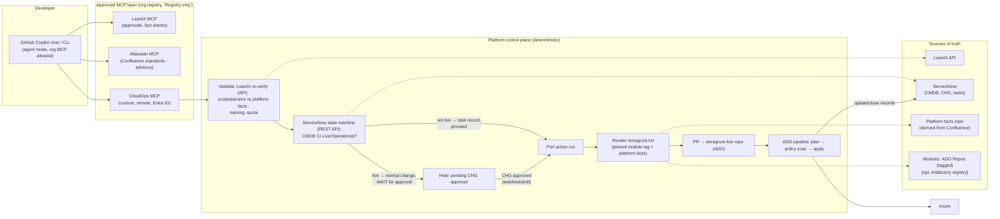
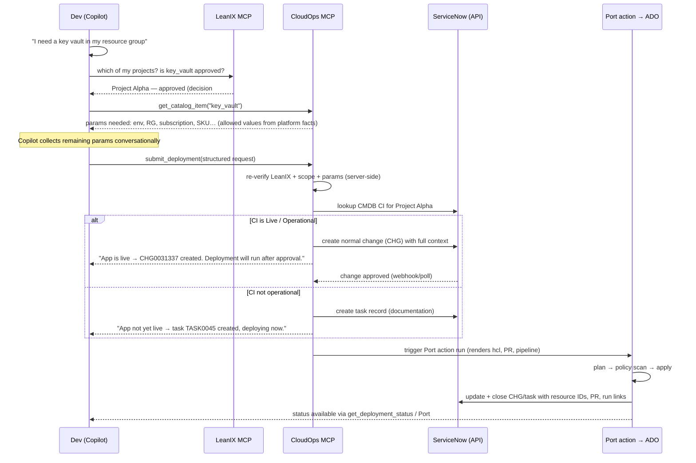

# Governed Self-Service Infrastructure via GitHub Copilot + MCP — Design v2

**Status:** Draft v2 — incorporates environment-specific constraints (see `decisions.md`)
**Scope:** Azure infrastructure self-service for application developers, governed by
LeanIX architecture approvals, gated by ServiceNow CMDB lifecycle state, executed
through Port IDP → Azure DevOps pipelines using curated Terraform/Terragrunt modules,
with standards sourced from Confluence.

---

## 1. Problem statement

Cloud Engineering deploys all infrastructure today via Terragrunt/Terraform modules
and Azure DevOps pipelines, fed by tickets. Tickets exist for two legitimate reasons —
**approval** (architecture disposition in LeanIX, change management in ServiceNow) and
**audit** — but the mechanism puts Cloud Engineering in the critical path of every
deployment.

**Target state:** developers self-serve from GitHub Copilot chat or Copilot CLI. The
platform — not a human — verifies LeanIX approval, selects the curated module, applies
the organization's standards, routes through ServiceNow correctly based on whether the
application is live, deploys via the existing Port→ADO pipeline machinery, and records
everything. Cloud Engineering curates modules, standards, and guardrails.

---

## 2. Confirmed product landscape (all GA as of mid-2026)

| Layer | Product | Notes |
|---|---|---|
| Chat interface | GitHub Copilot agent mode (VS Code/JetBrains) + Copilot CLI, MCP-capable | Org/enterprise **MCP registry + "Registry only" allowlist** enforces which MCP servers can be used |
| Architecture approvals | **SAP LeanIX built-in MCP server** (OAuth 2.0, per-user permissions) + LeanIX REST/GraphQL for server-side re-verification | 40+ tools over fact sheets, decisions, tech stacks |
| Standards context | **Atlassian (Rovo) remote MCP server** for Confluence (OAuth 2.1, admin client-allowlisting, respects page permissions) | Advisory tier only — see §5.3 |
| Execution backbone | **Port IDP** — actions trigger ADO pipelines; official Port MCP server with OAuth client-credentials machine auth | Already deployed in our environment, already wired to ServiceNow + Azure |
| IaC | Terraform/Terragrunt; modules in ADO Repos; optional Artifactory Terraform registry | HashiCorp Terraform MCP server not required (it targets HCP/TFE registries) — CloudOps MCP serves module schemas instead |
| Audit / change | **ServiceNow REST API** (Table + Change Management APIs) called machine-to-machine | ServiceNow MCP exists; deferred (D4) |
| Governance glue | **CloudOps MCP server** (our build) | The one component we build |

---

## 3. Design principles

1. **The chat is a front-end, not a control plane.** Copilot identifies the project,
   reads approvals, asks the right questions, and assembles a *structured request*.
   All authorization, validation, standards application, and deployment execute
   deterministically server-side. Worst case for LLM error or prompt injection is a
   rejected request — never an unauthorized or non-compliant deployment.
2. **Approval is data, not conversation.** LeanIX disposition = entitlement to a
   component type. ServiceNow CMDB state = which process applies. Both are read by
   machines and re-verified server-side at submit time.
3. **Modules are the guardrail.** Private endpoints, diagnostic settings, backup
   policy attachment, RBAC baselines, mandatory tags are *inside* the modules.
   Free-form agent-authored Terraform is never applied through this channel.
4. **Standards are code, prose is context.** Confluence remains the human source of
   truth; everything that must be *enforced* is compiled into machine-readable
   artifacts (module defaults, platform facts, policy-as-code). The LLM never
   "interprets" a Confluence page to pick a vnet. (§5.3, §6)
5. **One execution backbone.** Port actions are the single mutation path
   (they already trigger our ADO pipelines). Every deployment is a Port action run:
   RBAC'd, logged, with run history — and a Git commit in the terragrunt-live repo.
6. **Audit is unskippable.** ServiceNow records are created by the orchestration
   layer via API before apply. No record → no deployment.
7. **Guardrails over gates.** Pre-approved patterns for non-live applications flow
   zero-touch; live applications wait for ServiceNow change approval; exceptions
   surface to humans.

---

## 4. Architecture



### 4.1 Conversation + lifecycle flow



Key UX note: for live applications the flow is **asynchronous by design** — a chat
session can't hold open for a multi-day change approval. The deployment request is a
durable object (a Port action run in a "waiting for approval" state). The developer
gets the CHG number immediately, can ask Copilot for status any time
(`get_deployment_status`), and the platform resumes automatically on approval.

---

## 5. Component design

### 5.1 Copilot client configuration (adherence starts here)

- **Org/enterprise MCP registry + "Registry only" policy**: publish an internal MCP
  registry containing exactly: LeanIX MCP, Atlassian MCP, CloudOps MCP (and GitHub's
  own). With the *Registry only* policy, any other MCP server is blocked by GitHub,
  not by instructions. This is the enforcement for "we must only use our MCP."
- **Repo/organization custom instructions** (`.github/copilot-instructions.md` +
  org-level instructions): define the CloudOps persona and workflow — always resolve
  the project first, always check entitlement before discussing parameters, never
  hand-write Terraform for deployment, always route through `submit_deployment`.
  A dedicated **chat mode / prompt file** ("Deploy infra") gives developers a
  consistent entry point.
- **Temperature reality check:** Copilot chat does not expose temperature, and
  temperature 0 wouldn't deliver adherence anyway — it reduces sampling variance,
  not error. Determinism is placed where it belongs: the LLM produces a *request*;
  deterministic code decides. See §6.

### 5.2 LeanIX (approvals)

Two consumption paths, deliberately separate:

1. **LeanIX MCP server in Copilot (UX path):** the agent finds the developer's
   application fact sheet, reads the disposition, and can explain *why* something is
   or isn't approved — with the developer's own LeanIX permissions (OAuth).
2. **LeanIX REST/GraphQL from CloudOps (enforcement path):** at `submit_deployment`,
   the server re-reads the disposition with a technical user. The client's claim is
   never trusted.

Prerequisite (the real Phase-0 work): approved components must be **machine-readable**.
Define a component taxonomy in LeanIX (ITComponent fact sheets or tagged relations)
whose keys map 1:1 to the module catalog: `key_vault`, `app_service`, `aks`, `sql_db`…
Disposition + target environment(s) live as structured attributes, not review-board
prose.

### 5.3 Confluence standards → two tiers

Your landing-zone docs, backup procedures, monitoring procedures, and auth standards
must shape every blueprint. But **prose read by an LLM at generation time is not an
enforcement mechanism** — retrieval can miss, pages can be ambiguous, and models can
misread. Split the standards into two tiers:

**Tier 1 — Enforced (machine-readable, Git-versioned):**
- **Platform facts store**: a small, versioned dataset (YAML in a Git repo, and/or
  modeled as Port catalog entities, which fits since Azure is already ingested there):
  vnet/subnet IDs per subscription/environment/region, backup policy IDs, Log
  Analytics workspace IDs, DNS zones, allowed SKUs/regions, naming rules. The
  Terragrunt generator resolves "which vnet" from this store — the LLM never picks.
- **Module defaults**: backup attachment, diagnostics, private endpoints, TLS/auth
  settings are *inside* the modules per the Confluence standards.
- **Policy-as-code**: OPA/Conftest checks in the ADO pipeline + Azure Policy as the
  runtime backstop encode the "must" rules from the docs.

**Tier 2 — Advisory (Atlassian MCP in Copilot):**
- Copilot uses the official Atlassian remote MCP server (GA, OAuth 2.1, respects
  Confluence permissions; Atlassian admins can allowlist which MCP clients connect)
  to *explain* standards, answer "why is backup configured this way", and assist
  Cloud Engineering when authoring new modules/blueprints.

**Sync discipline:** when a Confluence standard changes, the platform team updates
the platform-facts repo / modules via PR (optionally agent-drafted, human-approved).
Confluence = source of truth for humans; the derived Git data = source of truth for
machines. Drift between them is a review item, not a runtime surprise.

### 5.4 CloudOps MCP server (our build)

Remote MCP server (Azure Container Apps/App Service), **Entra ID auth with the
developer's identity** — every call attributable, no shared secrets. Deliberately
small tool surface:

| Tool | Purpose |
|---|---|
| `list_my_projects()` | Projects the caller belongs to (LeanIX ↔ Entra group mapping) |
| `list_catalog()` / `get_catalog_item(type)` | Component types, module version, required/optional params with **allowed values resolved from platform facts** (so Copilot asks only valid questions) |
| `check_entitlement(project, type)` | LeanIX disposition (server-side) + returns the ServiceNow process that will apply (change vs task) so the dev knows upfront |
| `validate_request(request)` | Dry-run of all checks; returns structured errors the agent can relay |
| `submit_deployment(request)` | The only mutating tool: re-validates, runs the ServiceNow state machine (§5.7), triggers the Port action |
| `get_deployment_status(id)` | Plan summary, CHG approval state, apply progress, resource IDs |

Implementation rules: `submit_deployment` accepts fully-specified JSON (the LLM's
job ends at producing it); idempotency keys on submits; project→subscription/RG scope
map enforced server-side; a denied entitlement returns a "path to yes" (offer to open
the LeanIX architecture-change request).

### 5.5 Modules: ADO Repos (+ optional Artifactory registry)

- Modules stay in **Azure DevOps Repos**, one repo (or monorepo) owned by Cloud
  Engineering. Releases are **git tags**; generated Terragrunt configs pin exact tags
  (`git::https://dev.azure.com/...?ref=v3.2.0`). Nothing floats.
- **Schema publishing:** the module release pipeline parses `variables.tf` +
  a `metadata.yaml` (display names, question phrasing, param→platform-fact bindings)
  and publishes the schema to the CloudOps catalog store. This is what makes the
  conversational parameter-gathering *grounded* — Copilot asks exactly what the
  module version requires, no more, no less. (This replaces the HashiCorp Terraform
  MCP server, which targets HCP/TFE registries we don't use.)
- **Optional (later):** publish tagged releases to the **JFrog Artifactory Terraform
  module registry** for immutable distribution, provenance, and Xray scanning —
  consistent with Artifactory already being the artifact home for Java/Node stacks.
  Not required for MVP; git tags in ADO are sufficient.

### 5.6 Execution: Port action (recommended) vs direct ADO

**Recommendation: Port.** Port is already the environment's glue — ServiceNow and
Azure are ingested into its catalog, and Port actions already trigger ADO pipelines.
Using Port as the execution backbone buys, for free: action run history and audit
trail, RBAC on who can run what, a native "waiting/manual approval" run state (maps
cleanly onto the CHG-approval hold), day-2 visibility in the portal, and a second
interface (the portal) over the *same* actions for devs who prefer forms — chat and
portal converge on one backend.

Shape: CloudOps MCP performs governance (LeanIX re-verify, ServiceNow state machine)
then triggers the Port action with the validated payload; the Port action runs the
ADO pipeline that renders the Terragrunt config, opens the PR, plans, policy-scans,
and applies. Port's official MCP server (OAuth client-credentials) can be used for the
machine-to-machine trigger, or Port's REST API directly.

**Alternative (documented, not chosen): direct ADO REST.** One fewer hop, but
re-implements run state, RBAC, and audit that Port already provides, and forks the
execution path away from the portal you already operate. Only preferable if Port
licensing/coverage becomes a constraint.

Either way, **the PR + pipeline remain the enforcement point**: plan, OPA/Conftest,
(optional) Infracost, then apply with the pipeline's workload identity. The MCP server
and the agent hold no Azure write credentials.

### 5.7 ServiceNow via REST API: the lifecycle state machine

All ServiceNow interaction is machine-to-machine from the CloudOps orchestration
(Table API / Change Management API), with an integration user + OAuth. Per D5:

```
resolve CMDB CI for the application (from LeanIX fact sheet ↔ CMDB mapping)
├─ operational_status ∈ {Live, Operational}
│    → create NORMAL CHANGE (full context: requester, project, LeanIX links,
│      component, params, plan will be attached when available)
│    → HOLD deployment (Port run in waiting state)
│    → on approval (webhook via SNOW Flow/Business Rule → CloudOps endpoint;
│      fallback: polling) → proceed within the change window
│    → on apply success/failure: update + close/cancel the CHG with results
└─ otherwise (not yet live)
     → create TASK record (documentation/audit), linked to project
     → proceed immediately
     → close task with resource IDs on completion
```

Design notes:
- The **CI resolution mapping** (LeanIX application ↔ CMDB CI) must be maintained;
  LeanIX–ServiceNow integrations exist for this, and Port's catalog (which ingests
  ServiceNow) can serve as the lookup index.
- Records are created **before** apply and closed **after** — audit coverage is
  structural. If ServiceNow is unreachable, the deployment does not proceed.
- Prefer **webhook-driven resume** (SNOW notifies CloudOps on CHG approval) over
  polling; keep a reconciliation poller as backup.
- Later, the ServiceNow MCP server can be added to Copilot *read-only* so devs can
  ask "where's my change?" conversationally — without moving any write into the LLM.

---

## 6. Absolute adherence: where determinism actually comes from

The requirement: no room for interpretation — only our MCP, only LeanIX-approved
architecture, only our documented standards. How each is actually enforced:

| Requirement | Wrong lever | Right lever |
|---|---|---|
| "Temperature 0" / no creativity | Not settable in Copilot chat; temp 0 ≠ correctness (it removes randomness, not error) | The LLM only ever produces a **structured request** validated against a schema with enumerated allowed values; deterministic code renders and executes. A wrong LLM answer becomes a *validation error*, not a wrong deployment |
| Only our MCP servers | Instruction text ("please only use…") | GitHub org/enterprise **MCP registry + "Registry only" allowlist policy** — non-registry servers are blocked by the platform |
| Only LeanIX-approved architecture | Trusting the agent's LeanIX lookup | Server-side re-verification against LeanIX API inside `submit_deployment`; scope maps (project → subscriptions/RGs) enforced server-side |
| Standards (vnet choice, backup, monitoring, auth) | LLM reading Confluence at generation time | Platform-facts store + module defaults + OPA/Conftest pipeline gates + Azure Policy backstop. Confluence via MCP is *explanatory context only* |
| Consistent agent behavior | Hoping the model behaves | Org + repo custom instructions, a pinned "Deploy infra" chat mode, and a tool surface so narrow there is no compliant path except the paved one |

The mental model: **treat the LLM like an untrusted web client.** Nothing a browser
sends is trusted by a good API; nothing the agent sends is trusted by CloudOps. All
the adherence properties are then properties of *your* code, which is testable and
auditable.

---

## 7. Governance matrix

| LeanIX disposition | CMDB CI state | Environment | Path |
|---|---|---|---|
| Approved | Not live | Non-prod | **Zero-touch**: task record auto-created, auto-deploy |
| Approved | Not live | Prod-designated resources | Task record + PR held for platform review (until trust established) |
| Approved | Live/Operational | Any | **Normal change**, deployment held until SNOW approval, auto-resume |
| Not approved | Any | Any | Blocked at chat time with reason; agent offers to open LeanIX architecture-change request |
| Policy scan fails / destructive plan / quota | Any | Any | Blocked; PR left open for Cloud Engineering |
| Outside catalog | Any | Any | Falls back to today's ticket process |

---

## 8. Security

- **Identity end-to-end:** Entra ID OAuth on CloudOps MCP (user identity), LeanIX MCP
  OAuth (user identity), Atlassian MCP OAuth (user identity, page permissions apply).
  Machine legs (LeanIX re-verify, ServiceNow API, Port trigger) use dedicated service
  principals/integration users with least privilege.
- **No agent-side cloud credentials:** only the ADO pipeline's workload identity can
  apply, scoped per subscription. MCP server has no Azure RBAC write roles.
- **Prompt-injection containment:** blast radius = a rejected request. Confluence/
  LeanIX content is data, not instructions; CloudOps validates every field against
  enumerations regardless of what the model "read."
- **Module supply chain:** tagged, reviewed releases; generator pins versions;
  (optional) Artifactory + Xray for scanning and immutability.
- **Backstops:** Azure Policy deny/audit stays on regardless of path.

---

## 9. Roadmap

**Phase 0 — Contracts (2–3 wks):** LeanIX component taxonomy ↔ module catalog keys;
LeanIX app ↔ CMDB CI mapping check; extract platform facts v1 from Confluence into
the Git store; define SNOW task template + normal-change template and the approval
webhook; stand up the org MCP registry (LeanIX + Atlassian + placeholder CloudOps).

**Phase 1 — Read-only pilot (2–4 wks):** LeanIX MCP + Atlassian MCP in Copilot for a
pilot team under "Registry only" policy; org/repo custom instructions. Devs can ask
"what am I approved to deploy and what will the process be?" Validates data quality
and UX with zero deployment risk.

**Phase 2 — CloudOps MVP (4–8 wks):** CloudOps MCP with catalog/entitlement/validate/
submit for **Key Vault, non-prod, non-live apps only** (task path — no approval wait
complexity); Port action + ADO pipeline; PR human-reviewed initially; SNOW task
automation.

**Phase 3 — Change-gated path:** enable Live/Operational apps: normal change creation,
webhook resume, change-window handling. Turn on zero-touch (auto-merge/apply) for the
Phase-2 pattern based on observed results.

**Phase 4 — Scale:** expand catalog (App Service, storage, SQL, AKS-adjacent), prod
paths, day-2 ops (resize, rotate, decommission — decommission updates LeanIX + CMDB),
drift reporting into chat, optional Artifactory module registry, optional ServiceNow
MCP read-only.

---

## 10. Open questions

1. Port licensing/limits for action-run volume at target scale?
2. Where exactly does the LeanIX↔CMDB CI mapping live today, and how reliable is it?
   (This is the join key for the whole SNOW state machine.)
3. Change windows: for live apps, do we auto-apply immediately on CHG approval or
   schedule into the approved window? (Recommend: window-aware.)
4. Who owns the platform-facts repo review when Confluence standards change —
   and do we want an automation that diffs Confluence pages and drafts the PR?
5. Naming standard enforcement: generator-computed names (recommended) vs
   dev-supplied names validated against regex?
6. Does the org MCP registry rollout cover JetBrains/CLI users on our versions, or
   do we need an interim conditional-access compensating control?

---

## 11. References

- SAP LeanIX MCP server — https://help.sap.com/docs/leanix/ea/mcp-server ·
  https://www.leanix.net/en/blog/mcp-server-for-sap-leanix-solutions
- Atlassian remote (Rovo) MCP server, GA — https://www.atlassian.com/blog/announcements/atlassian-rovo-mcp-ga ·
  https://github.com/atlassian/atlassian-mcp-server
- Port MCP server & AI-built actions — https://docs.port.io/guides/all/build-port-actions-with-mcp/ ·
  machine auth: https://docs.port.io/agent-management/port-mcp-server/token-based-authentication/
- Port → Azure Pipelines backend — https://docs.port.io/actions-and-automations/setup-backend/azure-pipeline/
- GitHub Copilot MCP registry & allowlist — https://docs.github.com/en/copilot/how-tos/administer-copilot/manage-mcp-usage/configure-mcp-server-access ·
  https://docs.github.com/en/copilot/reference/mcp-allowlist-enforcement ·
  https://github.blog/changelog/2025-11-18-internal-mcp-registry-and-allowlist-controls-for-vs-code-stable-in-public-preview/
- Azure MCP Server 2.0 (remote/self-hosted) — https://devblogs.microsoft.com/azure-sdk/announcing-azure-mcp-server-2-0-stable-release/
- Agentic platform engineering pattern (Microsoft) — https://devblogs.microsoft.com/all-things-azure/agentic-platform-engineering-with-github-copilot/ ·
  https://devblogs.microsoft.com/all-things-azure/platform-engineering-for-the-agentic-ai-era/
- HashiCorp Terraform MCP server (evaluated, not required) — https://www.hashicorp.com/en/blog/terraform-mcp-server-is-now-generally-available
- Guardrails-not-gates / agents change self-service — https://platformengineering.com/features/your-self-service-platform-was-built-for-humans-ai-agents-change-the-rules/
